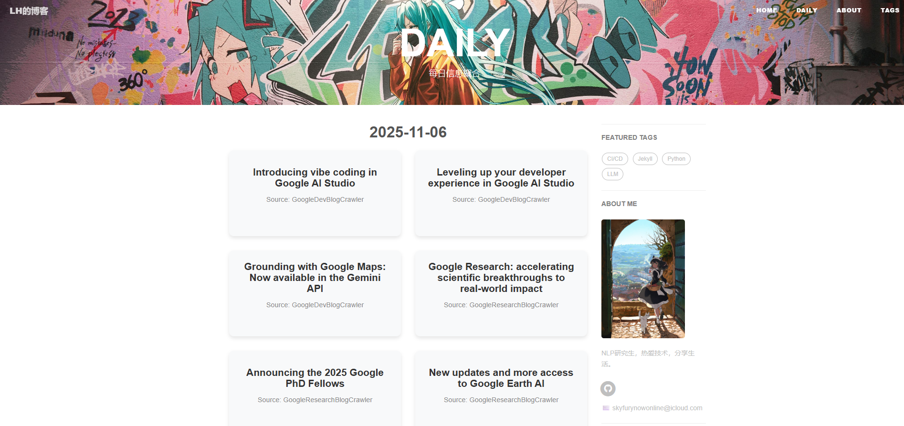

# 个人知识库与博客搭建指南

本项目是一个高度定制化的 Jekyll 静态博客，核心特色是深度集成了 **Python 自动化工作流** 和 **基于 LLM 的内容爬虫聚合系统**。



## 核心页面与项目构造

博客不单单是一个文章列表，而是由几个核心的自定义页面组成：

1. **Home 首页 (`index.html`)**：
   - 采用了**专栏卡片式**的响应式设计。首页的展示完全由 `_data/homepage_groups.yml` 驱动，通过数据循环渲染出不同领域的学习卡片（如“NLP工坊”、“博客开发指南”、“视野”等）。
2. **Daily 资讯聚合页 (`daily.html`)**：
   - 这是一个利用 GitHub Actions 定时更新的动态页面。它展示了每天全自动抓取回来的高质量技术文章和论文。
3. **文章详情页 (`_layouts/post.html`)**：
   - 支持多级侧边栏目录（`catalog: true`），优化了长篇技术文章的阅读体验。

**目录结构：**
- `_data/`: 驱动首页卡片展示、每日爬虫聚合的数据源。
- `_posts/`: 所有撰写的 Markdown 博客文章。
- `crawlers/`: Python 自动化爬虫脚本集。
- `.vscode/`: 包含快捷输入指令 `markdown.code-snippets`，提升写博客的效率。
- `.github/workflows/deploy.yml`: 自动化部署编排。

## LLM 资讯爬虫与 Daily 页面

`daily.html` 的数据来源于我们自研的自动化爬虫：

1. **动态抓取 (`crawlers/specific_crawlers/`)**：针对需要 JavaScript 渲染的复杂页面，集成了 Selenium 无头浏览器来完整拉取技术社区最新的文章列表及正文。
2. **LLM 智能摘要 (`crawlers/main.py`)**：为了将冗长的文章精炼展示，我们在爬取后会调用大语言模型（LLM）API。通过 `crawlers/config.json` 设定的 System Prompt，AI 会提取每篇文章的核心 100 字摘要。
3. **本地图床缓存**：异步下载外部图片至 `cache/`，确保资讯图片不挂。
4. **数据聚合**：最终整合生成每日的 JSON 文件存入 `_data/` 目录，供 `daily.html` 渲染。

## GitHub Actions CI/CD 流水线

通过 `.github/workflows/deploy.yml`，网站实现了全自动发布，做到“本地仅写 Markdown，云端负责一切”：
1. **触发机制**：推送代码到 `master` 分支，或每日定时触发。
2. **环境就绪**：安装 Python 环境和 `requirements.txt` 中的爬虫依赖。
3. **任务执行**：运行爬虫并生成新的 Daily JSON。
4. **Jekyll 编译部署**：使用 Jekyll 引擎将所有内容（Markdown、数据驱动组件）静态化，最终部署至 GitHub Pages CDN。

## 极速创作指南

### 1. 新建一篇博客
我们通过 VS Code 的 snippets 大幅简化了发文流程。
- 在 `_posts/` 目录下新建一个形如 `YYYY-MM-DD-your-title.md` 的文件。
- 输入 **`!post`** 并按 `Tab` 键。系统将自动补全所有的 Jekyll Front Matter（头部信息），包括自动填写当天日期。
- 利用 `Tab` 可以在标题、标签之间快速跳转，完成基本设置。
- **注意关联**：在 `_data/homepage_groups.yml` 找到对应的分类，将这篇文件的名字填入其 `posts` 列表中，文章就能在主页上显示了。

### 2. 新建一个专栏/分组
本站完全是**数据驱动**的，新建一个首页卡片分组无需修改 HTML/CSS：
1. 打开 `_data/homepage_groups.yml`。
2. 增加一条数据，例如：
   ```yaml
   - group_name: "音乐分享"
     url: "/groups/music"
     group_image: "/img/cover-music.svg"
     group_description: "分享最近听到的好歌"
     posts: []
   ```
3. 在 `img/` 下放一张 `cover-music.svg`。
4. 在 `_groups/` 目录下新建 `music.md` 承载路由，利用 Liquid 的 `` 引入文章列表。
一个全新的响应式板块就自动在首页上线了！